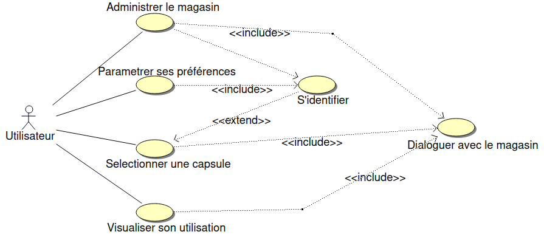
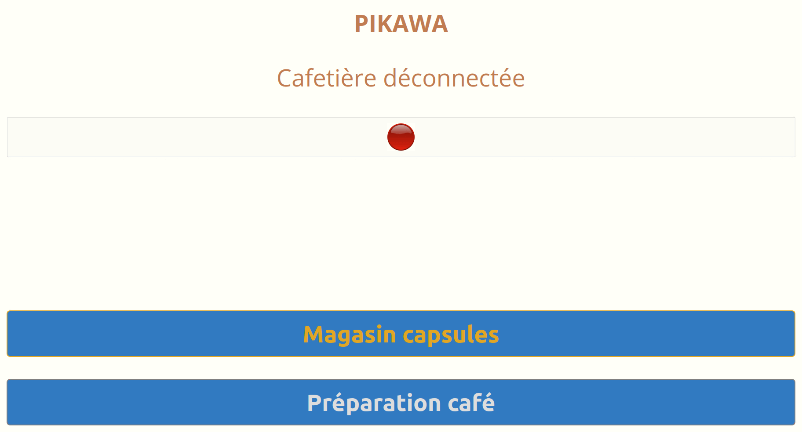
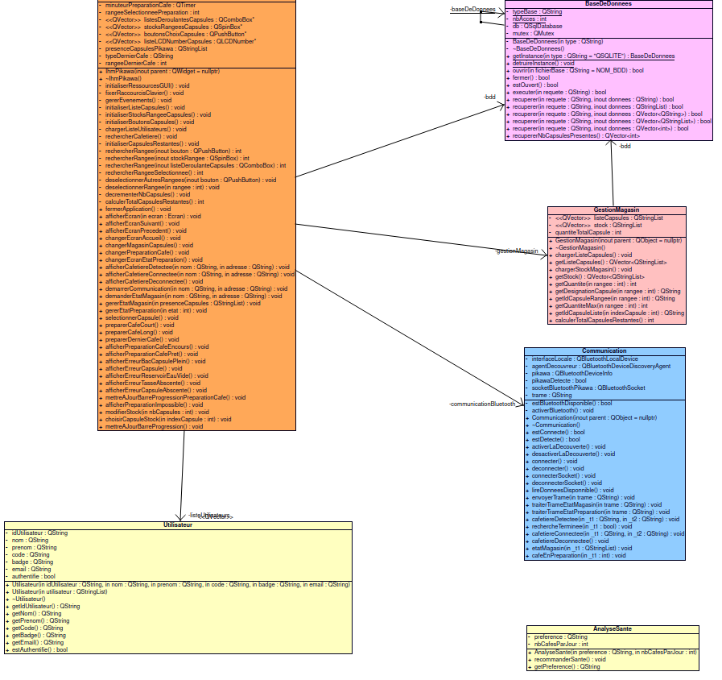
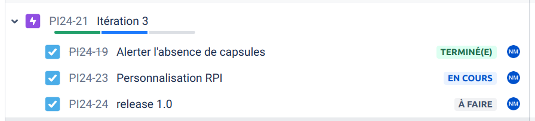
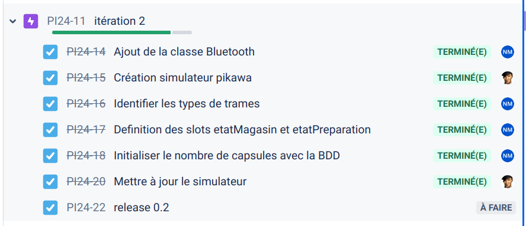
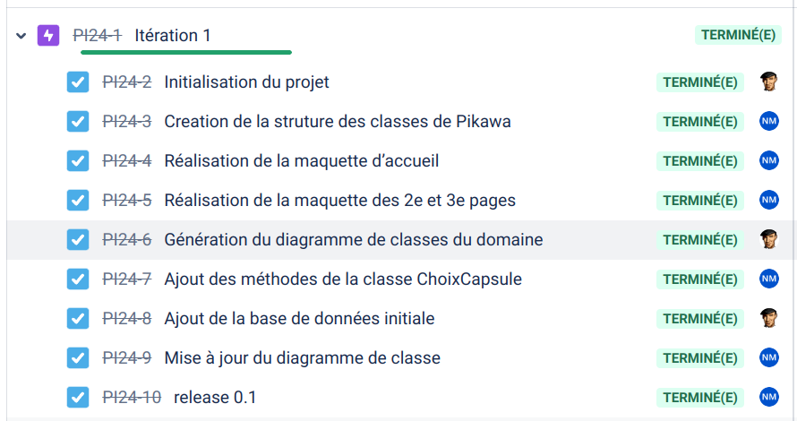

 

 

# Le projet pikawa 2024

- [Le projet pikawa 2024](#le-projet-pikawa-2024)
  - [Présentation](#présentation)
  - [Fonctionnalités](#fonctionnalités)
  - [Screenshots](#screenshots)
  - [Diaporama de présentation](#diaporama-de-présentation)
  - [Diagramme de classes](#diagramme-de-classes)
  - [Protocole](#protocole)
  - [Historique des versions](#historique-des-versions)
  - [Documentation du code](#documentation-du-code)
  - [Auteurs](#auteurs)

---

## Présentation

Pikawa est une machine à café connectée, équipée d’un magasin rotatif et motorisé de capsules, et pilotable grâce à un écran tactile et un logiciel embarqué sur Raspberry Pi.

L'utilisateur pourra :

- Sélectionner une capsule, le type de capusule (type de capsule, type de café, dernier café)
- Administrer le stock du magasin, la possibilité de pouvoir reapprovisionner la quantité de capsules lorsque cela est nécessaire
- Être alerté si une capsule est présente ou abscente
- Visualiser un bilan de santé pour pouvoir connaître sa consommation  avec son taux de cafeine et son nombre de cafés par jour
- Lancer la préparation d'un café (Ristretto, Espresso et Lungo)
- S'identifier par un badge RFID, la personne qui est identifiée se verra attribuer plusieurs options comme suivre sa consommation et de gérer ses préférences

## Fonctionnalités

| Fonctionnalités                          | OUI | NON |
| ---------------------------------------- | :-: | :-: |
| Administrer le magasin de capsules       |  X  |     |
| Gestion du type de capsule               |  X  |     |
| Suivi de l'état du stock                 |  X  |     |
| Sélectionner une capsule                 |  X  |     |
| Lancer la préparation d’un café          |  X  |     |
| Gérer l'état d'une préparation d’un café |  X  |     |
| Être alerté en cas d'erreur              |  X  |     |
| Communiquer avec la cafetière            |  X  |     |

## Screenshots

## Diaporama de présentation

- [Nakib Mdoiouhoma - Oral.pptx](diaporamas/Nakib%20Mdoiouhoma%20-%20Oral.pptx)

## Diagramme de classes

## Protocole

Format général : `#PIKAWA~{TYPE}~[DONNÉES~]\r\n`

Les différents {TYPE} de trames :

- `M` : état du magasin
- `P` : préparation d’un café

Trames de requête/réponse pour le magasin

Format de la requête (application→cafetière) : `#PIKAWA~M~\r\n`

Cette trame est envoyée par l’application pour connaître l’état du Magasin (présence de capsule dans les rangées)

Format de la réponse (cafetière→application) : `#PIKAWA~M~R1~R2~R3~R4~R5~R6~R7~R8~\r\n`

Pour chaque Rangée de 1 à 8, la valeur 1 indiquera que la présence d’une capsule dans le magasin sinon 0

Exemple : `#PIKAWA~M~0~0~0~0~0~1~0~0~\r\n`

Seul la rangée 6 a une capsule

Trame de commande d’un café

Format de la commande (application→cafetière) : `PIKAWA~P~NUMÉRO_RANGEE~LONGUEUR~\r\n`

Le champ `NUMÉRO_RANGEE` aura une valeur de 1 à 8 pour sélectionner la capsule dans le magasin.

Le champ LONGUEUR aura 3 états possibles :

- `1` Ristretto (Court)
- `2` Espresso
- `3` Lungo (Long)

Cette trame est envoyé lorsque l’utilisateur lance la Préparation d’un café

Exemple : `#PIKAWA~P~6~3~\r\n`

Explication : Préparation d’un café de type Lungo avec la capsule de la rangée 6

Format de la réponse (cafetière→application) : `#PIKAWA~P~ETAT~\r\n`

Le champ ÉTAT à 9 états possibles :

- `0` : le café est prêt ou au repos
- `1` : le café est en cours de préparation
- `2` : impossible (préparation déjà en cours)
- `3` : erreur capsule
- `4` : bac capsules plein
- `5` : réservoir eau vide
- `6` : numéro de rangée incorrect
- `7` : type de longueur incorrect
- `8` : absence tasse
- `9` : absence capsule

## Historique des versions

- Version 1.0 : 08/06/2024

- Version 0.2 : 24/05/2024

- Version 0.1 : 05/04/2024

## Documentation du code

https://btssn-lasalle-84.github.io/pikawa-2024/

## Auteurs

- Étudiant IR : MDOIOUHOMA Nakib <<nakibmdoiouhoma.btssn@gmail.com>>

---
©️ LaSalle Avignon 2024
