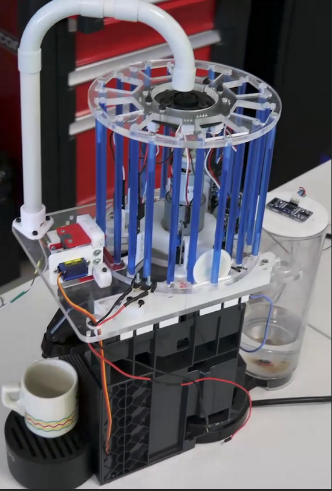
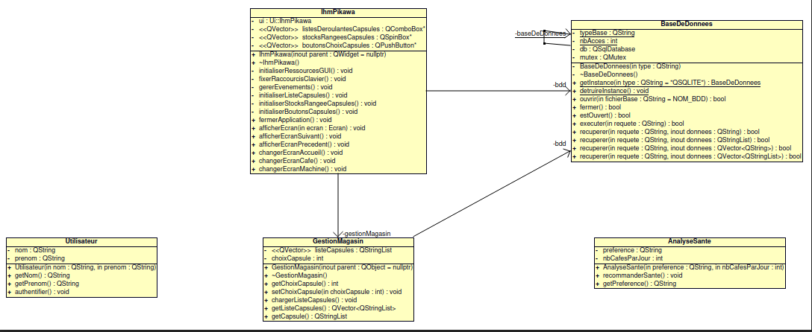
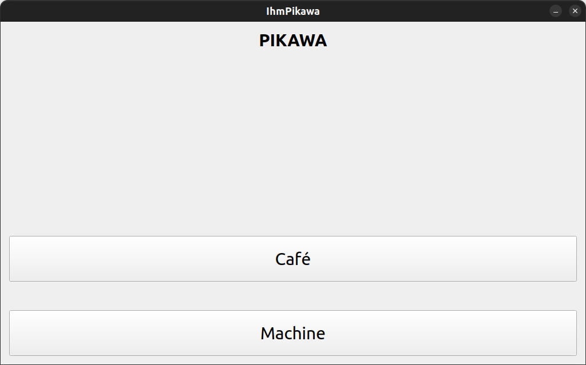
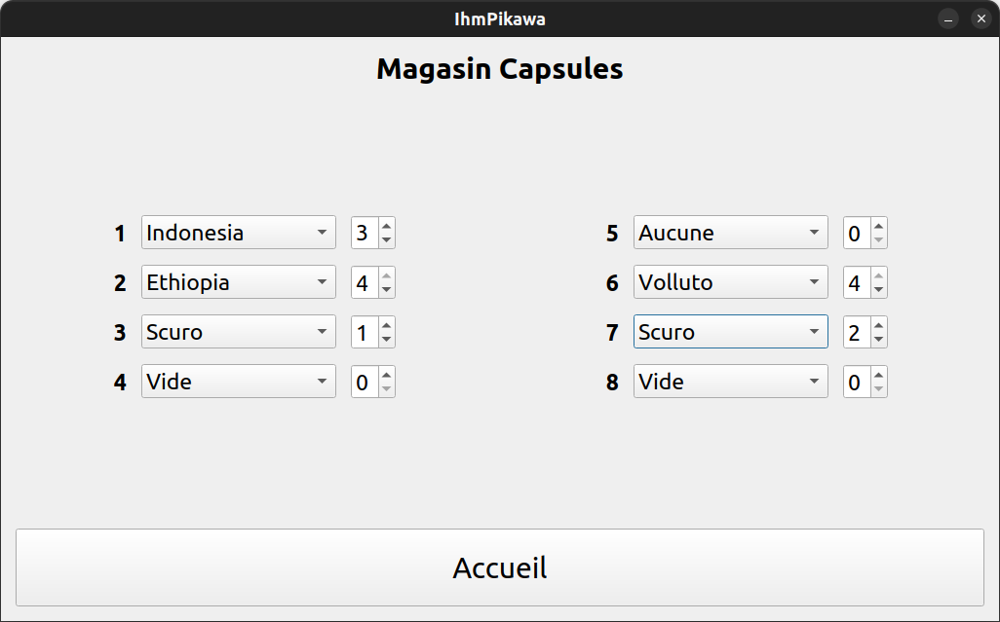
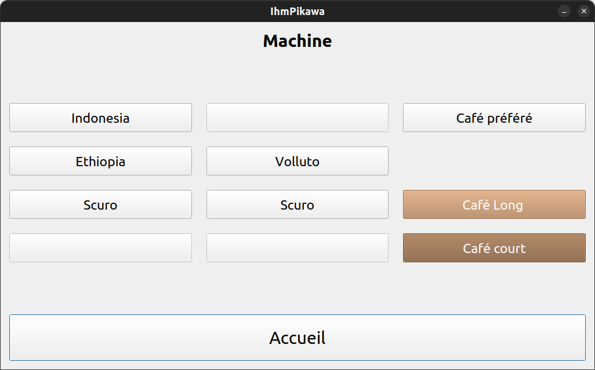

 

 

# Le projet pikawa 2024

- [Le projet pikawa 2024](#le-projet-pikawa-2024)
  - [Présentation](#présentation)
  - [Fonctionnalités](#fonctionnalités)
  - [Documentation du code](#documentation-du-code)
  - [Diagramme de classes](#diagramme-de-classes)
  - [Protocole](#protocole)
  - [Screenshots](#screenshots)
  - [Historique des versions](#historique-des-versions)
  - [Auteurs](#auteurs)

---

## Présentation

Pikawa est une machine à café connectée, équipée d’un magasin rotatif et motorisé de capsules, et pilotable grâce à un écran tactile et un logiciel embarqué sur Raspberry Pi.

L'utilisateur pourra :

- Sélectionner une capsule, le type de capusule (type de capsule, boisson preférée)
- Administrer le stock du magasin, la possibilité de pouvoir reapprovisionner la quantité de capsules lorsque cela est nécessaire
- S'identifier par un badge RFID, la personne qui est identifiée se verra attribuer plusieurs options comme suivre sa consommation et de gérer ses préférences
- Être alerté si une capsule est présente ou abscente
- Visualiser un bilan de santé pour pouvoir connaître sa consommation  avec son taux de cafeine et son nombre de cafés par jour
- Lancer la préparation d'un café (Ristretto, Espresso et Lungo)

## Fonctionnalités

- Affichage de l'écran d'accueil
- Affichage de l'écran permettant d'administrer le stock du magasin
- Affichage de l'écran de sélection d'une capsule

## Documentation du code

https://btssn-lasalle-84.github.io/pikawa-2024/

## Diagramme de classes

## Protocole

## Screenshots

## Historique des versions

- Version 0.1 : 05/04/2024
  - Réalisation de l'ihm
  - Création d'une base de donnée contenant le stock de capsules
  - Création de la structure des classes du projet

## Auteurs

- Étudiant IR : MDOIOUHOMA Nakib <<nakibmdoiouhoma.btssn@gmail.com>>

---
©️ LaSalle Avignon 2024
